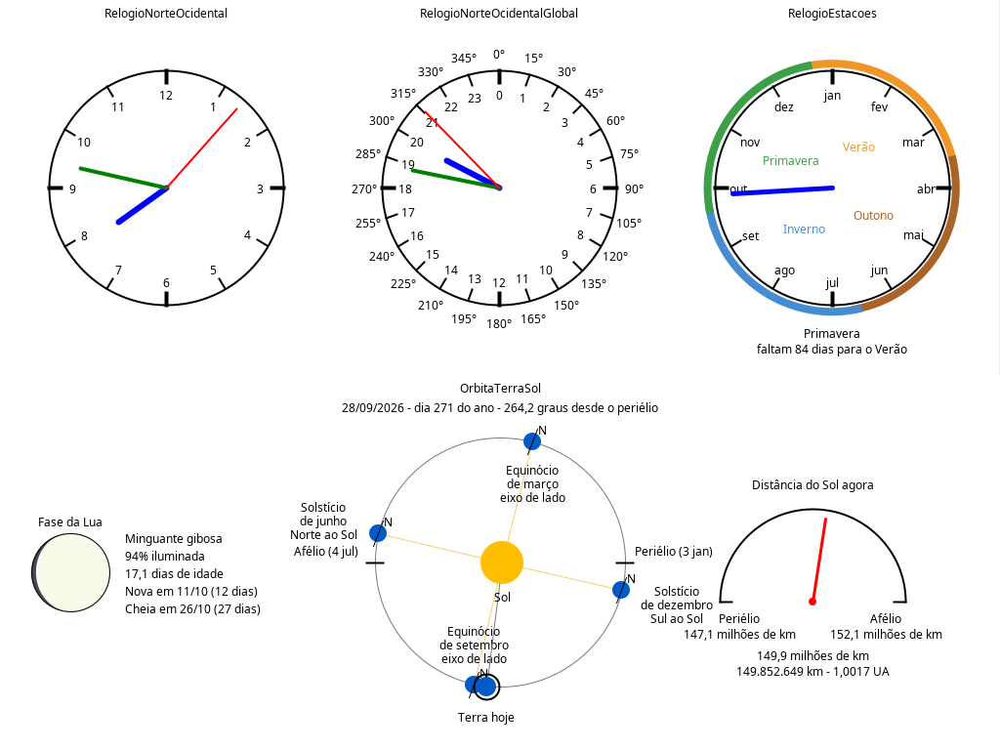
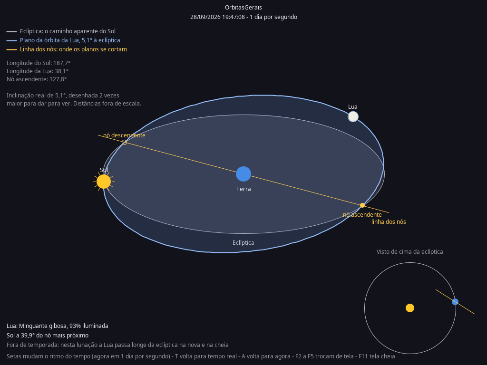
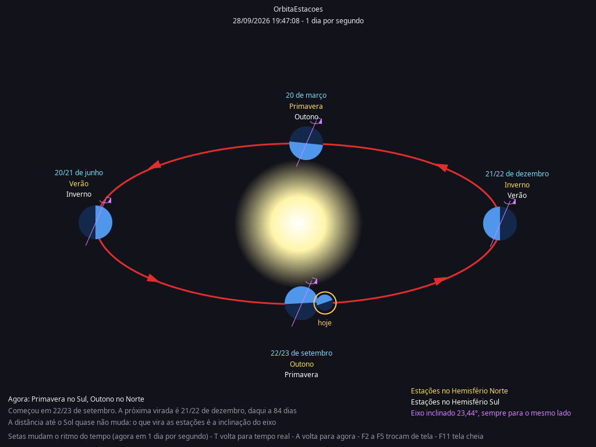
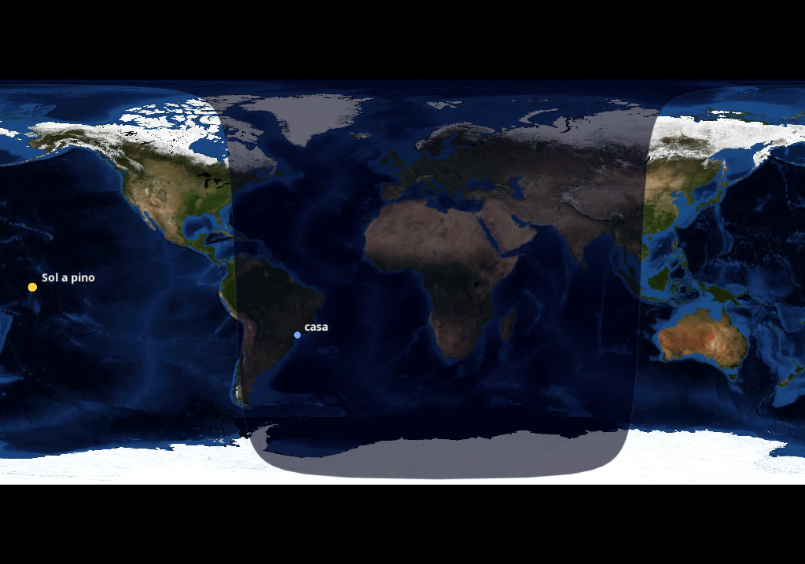
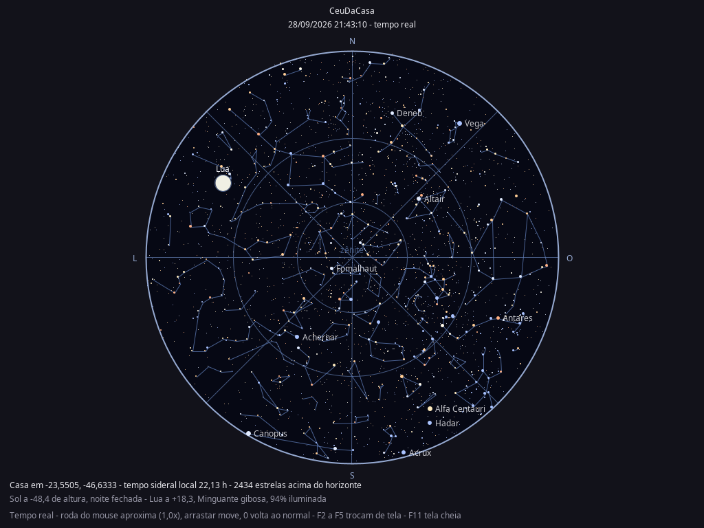

# relógio.brasileiro

Isto aqui começou como um `JFrame` com um círculo preto e um ponteiro azul apontando para lugar nenhum. Um `//you have to implement this function` dizia o que faltava.

Hoje ele calcula onde o Sol está batendo no planeta neste segundo, em que fase a Lua está, por que existem estações, por que não acontece eclipse todo mês, e desenha o céu que você veria se saísse na varanda agora, com as 5042 estrelas que o olho nu alcança.

Java e Swing, sem biblioteca de gráficos além do que vem no JDK. A única exceção é o NASA WorldWind, que desenha o globo, e ele está aqui dentro, em código fonte, compilado junto.

## Rodando

Precisa de **JDK 21** e Maven.

```bash
mvn package
java -jar target/relogio.brasileiro-0.0.1-SNAPSHOT.jar
```

O `mvn package` põe as dependências em `target/lib` e escreve o caminho delas no manifesto, então o `java -jar` basta. Durante o desenvolvimento, `mvn compile` e `java -cp target/classes com.scicrop.relogio.brasileiro.App` também servem, só o globo não abre assim, porque ele precisa das bibliotecas de OpenGL.

## As telas

| Tecla | Tela | O que tem nela |
|---|---|---|
| inicial | Relógios | três mostradores e a órbita da Terra |
| `F2` | `OrbitasGerais` | a eclíptica, o plano da órbita da Lua e a linha dos nós |
| `F3` | `OrbitaEstacoes` | por que existem as estações |
| `F4` | `GloboTerrestre` | onde é dia e onde é noite, agora |
| `F5` | `CeuDaCasa` | o céu visto da sua casa |
| `F11` | | tela cheia, sem bordas de janela |

Cada troca desmonta a tela anterior e constrói a nova do zero. Em `F2` e `F3` as setas mudam o ritmo do tempo, de tempo real até **um ano por segundo**, que é quando dá para ver a linha dos nós girar. `T` volta para tempo real, `A` traz a data de volta para hoje.

### A tela inicial



O `RelogioNorteOcidental` é o relógio de sempre. O `RelogioNorteOcidentalGlobal` mostra a mesma hora em **graus, minutos e segundos de arco** da rotação da Terra: o mostrador tem 24 horas e 360 graus, e o ponteiro vermelho dá uma volta a cada 4 segundos. Não é bug: 1 segundo de arco passa em 1/15 de segundo, porque a Terra gira 15 graus por hora. O `RelogioEstacoes` é um ano por volta, com as quatro estações do hemisfério sul em arcos coloridos.

Embaixo, a órbita da Terra com periélio e afélio marcados, um mostrador da distância até o Sol e a fase da Lua.

### F2, as órbitas juntas



A resposta para "se a Lua dá uma volta por mês, por que não tem eclipse todo mês": o plano da órbita dela é inclinado 5,1° em relação à eclíptica, e os dois planos só se cruzam na linha dos nós. Só há eclipse quando a lua nova ou a cheia acontece perto de um nó, e a linha dos nós ainda gira para trás, uma volta a cada 18,6 anos.

A inclinação está desenhada 2 vezes maior que a real. Com 5,1° de verdade, os dois planos ficariam praticamente sobrepostos e o desenho não explicaria nada.

### F3, as estações



A Terra nas quatro posições que marcam as estações, com o eixo inclinado 23,44° **sempre apontando para o mesmo lado do espaço**. Em amarelo o que começa no hemisfério norte, em branco o que começa no sul.

O detalhe que me convenceu de que a conta está certa: nada no código diz "dezembro fica à direita". As posições saem da longitude do Sol na data e o eixo é sempre desenhado inclinado para o mesmo lado. A Terra de dezembro aparece à direita com o polo norte virado para longe do Sol, hemisfério sul iluminado, verão aqui embaixo. Sai sozinho.

### F4, dia e noite agora



A noite é um círculo de 90° de raio centrado no ponto oposto ao subsolar: tudo que está a mais de um quarto de volta de onde o Sol está a pino não vê o Sol. A borda é o terminador, e ele anda 15 graus por hora.

A marca "casa" sai do `data/config.json`, e fica amarela de dia e azul de noite. Embaixo, a hora local e UTC, o ponto subsolar, a altura e o azimute do Sol na sua casa, e os horários do nascer e do pôr.

Esta é a tela que usa o WorldWind.

### F5, o céu de casa



Zênite no centro, horizonte na borda, projeção estereográfica, a mesma dos planisférios de papel. Como você está olhando para cima e não para um mapa, **o leste fica à esquerda**.

São 5042 estrelas até magnitude 6, com o tamanho pelo brilho e a cor pelo índice B menos V. As mais brilhantes vêm com nome. O Sol e a Lua entram por cima, a Lua na fase certa. O fundo acompanha a altura do Sol: azul de dia, escurecendo pelos crepúsculos civil, náutico e astronômico até o preto da noite fechada, e as estrelas somem no clarão.

Esta tela anda **só em tempo real**. Acelerar as estrelas ficava bonito e mentia sobre o que você veria olhando para cima agora.

## data/config.json

```json
{"home":[-46.6333,-23.5505]}
```

Longitude primeiro, latitude depois, na ordem do GeoJSON. É de onde saem a marca no globo e o céu do F5.

⚠️ **Esse arquivo é o seu endereço.** Com sete casas decimais ele localiza a porta da sua casa. Ele está no `.gitignore`, e o que vai versionado é o `data/config.exemplo.json`, com a Praça da Sé. Se for publicar capturas de tela, lembre que o F4 e o F5 escrevem as coordenadas na tela.

## De onde vêm os números

Nada aqui é figura estática:

- **Sol**: elementos médios com a equação do centro. Nos equinócios de 2026 a declinação dá 0,00 e nos solstícios ±23,44. O pôr do sol previsto para São Paulo bateu com o instante em que o Sol cruzou o horizonte, com dezenas de segundos de diferença.
- **Lua**: a fase vem da contagem de lunações desde uma lua nova conhecida; a posição no céu vem dos termos maiores da órbita. Os dois modelos são independentes e concordam na distância angular até o Sol dentro de 1 a 2 graus.
- **Estrelas**: catálogo Hipparcos até magnitude 6, o mesmo que vem com o WorldWind.
- **Estações**: datas fixas (20/3, 21/6, 22/9, 21/12). Elas variam um dia conforme o ano.

E as aproximações assumidas, para ninguém se enganar: a Terra percorre a órbita com velocidade angular constante (sem a segunda lei de Kepler, erro abaixo de 0,03% na distância até o Sol), as fases da Lua usam lunação média (erro de até meio dia na data), e as inclinações e distâncias dos diagramas estão fora de escala **de propósito**, porque a inclinação real da órbita lunar é invisível num desenho deste tamanho.

## O WorldWind mora aqui dentro

Em `src/worldwind/` estão 1300 arquivos `.java` do [NASA WorldWind](https://github.com/NASAWorldWind/WorldWindJava) v2.2.1, sob Apache 2.0. Não é um jar baixado: o `mvn compile` compila esse fonte junto com o do projeto.

O que foi alterado em relação ao original está anotado no `src/worldwind/LEIAME.md`. Em resumo, o suporte a GDAL saiu: ele servia para ler arquivos de raster do disco, coisa que nenhuma tela faz, e obrigava a carregar um jar de ligações nativas que ninguém aqui executa.

Sobrou uma dependência binária só, e ela não tem como ser compilada a partir de fonte Java: o **JOGL**, que são as ligações OpenGL e é escrito em C. Vem do Maven Central com os binários nativos de cada plataforma.

## O código

```
src/main/java/com/scicrop/relogio/brasileiro/
  App          Tela           Relogio        Cena
  RelogioNorteOcidental       OrbitaTerraSol OrbitasGerais
  RelogioNorteOcidentalGlobal FasesDaLua     OrbitaEstacoes
  RelogioEstacoes             Lua            GloboTerrestre
  Configuracao                PosicaoDoSol   CeuDaCasa
  CatalogoDeEstrelas          PosicaoDaLua   Horizonte
```

`Relogio` é a base dos mostradores redondos, `Cena` é a base das telas de céu (fundo escuro, relógio acelerado, teclas). As classes de conta, `PosicaoDoSol`, `PosicaoDaLua`, `Lua` e `Horizonte`, não desenham nada e não dependem de Swing.

O `FasesDaLua` é uma tela inteira que não está montada em tecla nenhuma. Ficou pronta, não entrou no layout, e continua compilando.

## O que ainda não tem

- **linhas das constelações** no F5. As estrelas estão nos lugares certos, falta o arquivo que diz quais ligar em quais.
- as camadas de atmosfera e iluminação do WorldWind, que estão no pacote `worldwindx` e não foram copiadas.
- a equação de Kepler, para a Terra andar mais rápido perto do periélio.

## Licença

Este projeto está sob a **Licença Apache, versão 2.0**. O texto completo está no arquivo [LICENSE](LICENSE).

O NASA WorldWind, em `src/worldwind/`, também é Apache 2.0, e a licença original dele está junto do código, em `src/worldwind/`.
